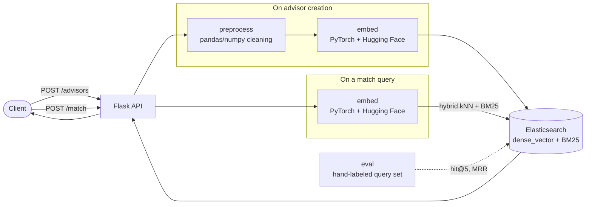

# advisor-match-service

[](https://github.com/sahilkalgutkar/advisor-match-service/actions/workflows/ci.yml)
[](https://codecov.io/gh/sahilkalgutkar/advisor-match-service)
[](codecov.yml)
[](LICENSE)

I built this to work back through an AI-based matching system the way I first built one during an internship - pairing clients with the right subject-matter expert from free text describing what they need - except this time with real infrastructure behind it I can actually show: a pandas/numpy cleaning pipeline, PyTorch/Hugging Face embeddings, and hybrid Elasticsearch search behind a Flask API, not a notebook.

## How it works

`preprocess` cleans a raw CSV of advisor profiles - normalizing whitespace, parsing tags and years-of-experience out of inconsistent free text, deduping the same advisor entered twice. `embed` turns each advisor's bio (and later, each client query) into a 384-dim vector with a small sentence-transformers model, a real PyTorch forward pass rather than a hosted embeddings API. `search` indexes those vectors into Elasticsearch alongside the text fields, and matches with **hybrid search** - kNN over the embedding blended with BM25 in the same request - rather than pure vector search, since a client's query might share vocabulary with an advisor's bio without being semantically identical, or vice versa.



`eval` measures whether any of this actually works: 10 hand-paraphrased queries against the seed dataset, checking whether the intended advisor shows up in the top-k results and where. Current numbers on the seed dataset: **90% hit@5, MRR 0.90** - a real measured number from `pytest`, not an assumed one.

## Running it locally

```bash
docker compose up --build
```

Brings up the API and a real Elasticsearch instance.

| Service | URL | Host port override |
|---|---|---|
| API | http://localhost:8080 | `API_HOST_PORT` |
| Elasticsearch | http://localhost:9200 | `ELASTICSEARCH_HOST_PORT` |

> Both host ports are overridable — 9200 is taken on any machine already
> running an Elasticsearch or OpenSearch. Set them inline or in `.env` (see
> `.env.example`), and point the seed script's `ELASTICSEARCH_URL` at whichever
> port you chose:
>
> ```bash
> ELASTICSEARCH_HOST_PORT=9201 docker compose up --build
> ELASTICSEARCH_URL=http://localhost:9201 python -m scripts.seed_index
> ```
>
> Only the host side moves — inside the compose network the API still reaches
> Elasticsearch on `http://elasticsearch:9200`.

Seed it with the sample advisor dataset:

```bash
pip install -r requirements.txt
ELASTICSEARCH_URL=http://localhost:9200 python -m scripts.seed_index
```

Then:

```bash
# Add an advisor directly (rather than via the seed script)
curl -X POST http://localhost:8080/advisors \
  -H 'Content-Type: application/json' \
  -d '{"name":"Dr. Elena Vasquez","bio":"Cardiologist specializing in heart surgery and cardiac care.","tags":["healthcare","cardiology"],"years_experience":18}'

# Find a match for a client query
curl -X POST http://localhost:8080/match \
  -H 'Content-Type: application/json' \
  -d '{"query":"Looking for an expert in heart disease and cardiac treatment","k":5}'
```

## Testing it

Each layer is tested at the level that actually proves something: pure logic (the pandas cleaning pipeline, the eval metric math) gets fast unit tests; anything that touches PyTorch, Elasticsearch, or the Flask app gets tested against the real thing via Testcontainers, not a mock. The test that matters most isn't a shape check - it's that two differently-worded cardiology bios embed closer together than a cardiology bio and a shipping-logistics one, and that a cardiac-care query actually ranks the cardiologist first.

```bash
pip install -r requirements-dev.txt
pytest
```

## Deploying it

Terraform (`terraform/`) provisions the target GCP environment: an Artifact Registry repository and a Cloud Run service sized for PyTorch and the embedding model. Elasticsearch itself isn't provisioned here - a real deployment would point at a managed Elastic Cloud cluster rather than self-hosting it on Cloud Run. Same posture as the Azure Terraform in `ledger-strangler-platform`: this describes the target infrastructure, it isn't kept running against a live GCP project.

## Stack

Python, Flask, pandas, NumPy, PyTorch, Hugging Face Transformers (via sentence-transformers), Elasticsearch, Docker Compose, Terraform (`google`), GitHub Actions, pytest, Testcontainers.
